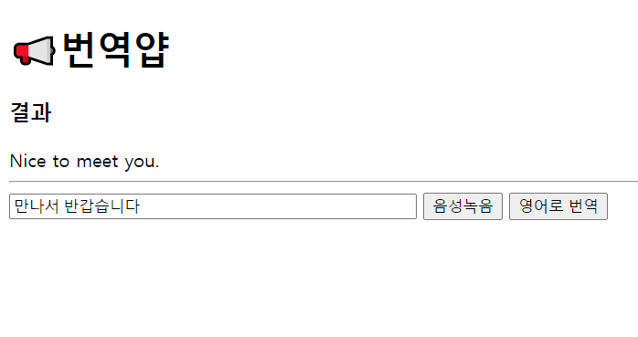
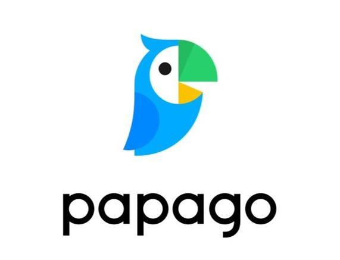
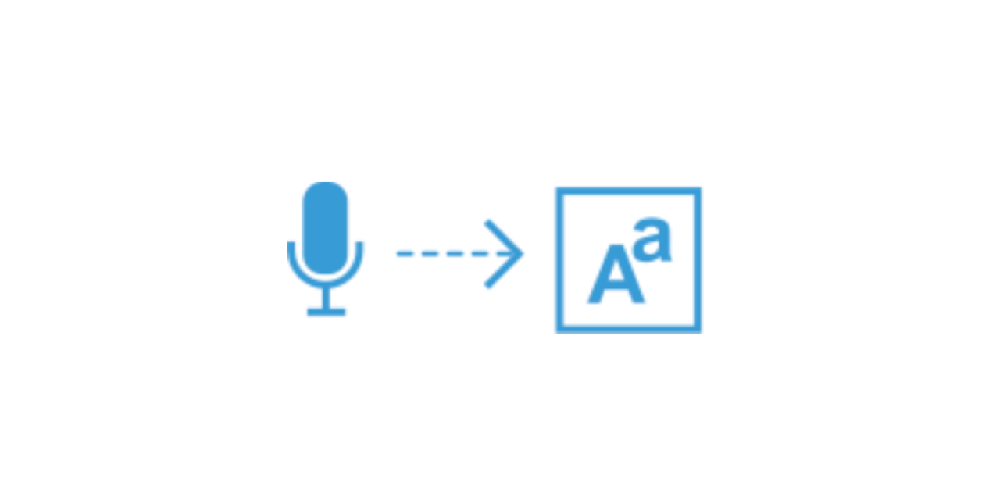

# 📢번역얍

음성인식 기반의 영어번역 어플리케이션 📢번역얍 무려 v0.0.1...!!!



### 기능

* 음성인식을 이용한 STT(Speech To Text)
* 한국어 문장을 영어로 번역하는 기능




### 구현
* 음성인식은 Chrome 내장 Speech Recognition API를 이용했습니다. (Chrome 외 브라우저에서는 동작하지 않을 수 있습니다.)
* 번역기능은 네이버 파파고 API를 이용했습니다.

### 실행
* git clone 후 프로젝트 root 디렉토리에.env 파일을 생성합니다.

* .env파일에 CLIENT_I, CLIENT_SECRET에는 네이버 개발자 센터에서 발급받은 id, secret 값을 넣어줍니다. PORT에는 웹서버가 listen할 포트번호를 넣어줍니다.
```
# .env 설정
CLIENT_Id={네이버 파파고 Client Id}
CLIENT_SECRET={네이버 파파고 Client Secret}
PORT={포트번호}
```
* 개발모드로 실행을 위해 ```npm start```로 어플리케이션을 실행한 후 http://localhost:{.env에 적은 PORT번호}를 브라우저에 띄웁니다. (Chrome 브라우저만 정상적으로 기능이 동작합니다.)
* 배포시에는 배포서버에 소스를 clone 한후 ```npm run prod:server```로 실행시킵니다.

##  참고자료
* 네이버 파파고 API: https://developers.naver.com/docs/papago/
* Speech Recognition API : https://developer.mozilla.org/en-US/docs/Web/API/SpeechRecognition
